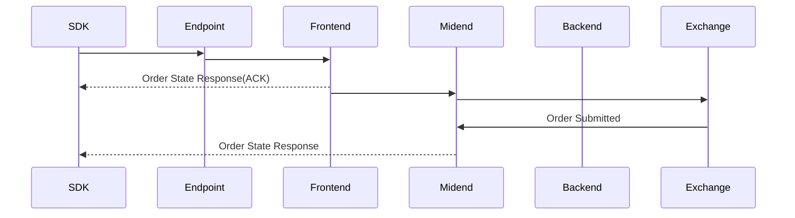
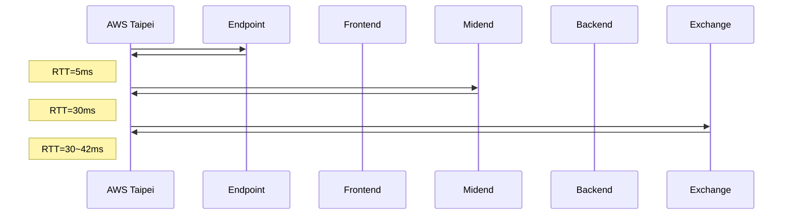

# Submit Order Analysis

## Sequence Diagram



## Round Trip Time


## Profiling

### Environment

#### Hardware
- CPU: AMD Ryzen 5 5600XT

#### Software
- GCC/G++: 13.3.0
- CMake: 3.28.3
- Build: Debug (no optimization, `-O0`)

### Methodology

#### Measurement Scope
- **Start**: Before `SubmitOrder()` call
- **End**: After `SubmitOrder()` returns
- **Includes**: Local CPU processing + network round-trip time

#### Tools
- `perf record` with DWARF call graph for CPU profiling (1000 Hz sampling)
- `strace` for syscall analysis
- `std::chrono::high_resolution_clock` for wall-clock timing

### Results

#### Processing Time
- **Average**: 1.1ms (local CPU processing, excluding network wait)

#### Syscalls

| Syscall | Description |
|---------|-------------|
| sendmsg | Send gRPC request over TLS |
| recvmsg | Receive gRPC response over TLS |
| epoll_wait | Wait for network events |

The SDK uses gRPC over TLS for communication. During `SubmitOrder()`:

1. **sendmsg**: Sends the order request (520 bytes, TLS encrypted)
2. **epoll_wait**: Waits for server response (~5-20 ms per wait)
3. **recvmsg**: Receives ACK and order state responses

#### Network Timeline

```
t=0.000 ms  sendmsg (order request)
t=0.1 ms    epoll_wait (waiting for ACK)
t=6.2 ms    recvmsg (ACK from Frontend)
t=8.1 ms    sendmsg (acknowledgement)
t=13.2 ms   recvmsg (order state from Midend)
t=33.0 ms   recvmsg (final response)
t=34.0 ms   return
```