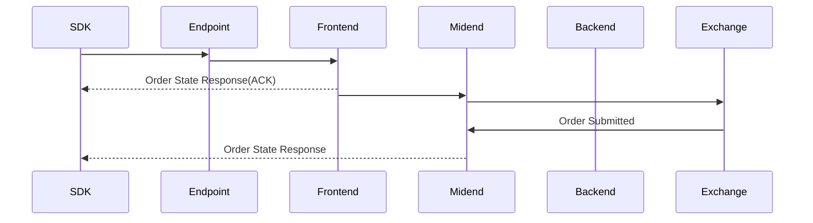
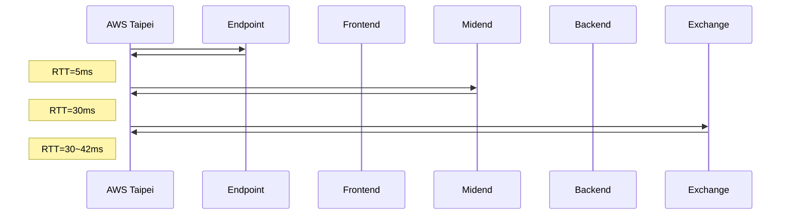

# Submit Order Analysis

## Sequence Diagram

## Round Trip Time

## Profiling

### Environment

#### Hardware

- CPU: AMD Ryzen 5 5900XT

#### Software

- GCC/G++: 13.3.0
- CMake: 3.28.3
- Build: Debug (no optimization, `-O0`)

### Methodology

#### Measurement Scope

- **Start**: Before `SubmitOrder()` call
- **End**: After `SubmitOrder()` returns
- **Includes**: Local CPU processing + network round-trip time

#### Tools

- `perf record` with DWARF call graph for CPU profiling (1000 Hz sampling)
- `strace` for syscall analysis
- `std::chrono::high_resolution_clock` for wall-clock timing

### Results

#### Processing Time

- **Average**: 1.1ms (local CPU processing, excluding network wait)

#### Network Timeline

| Time (ms) | Syscall    | Size      | Description               |
| --------- | ---------- | --------- | ------------------------- |
| 0.0       | sendmsg    | 520 bytes | Submit order request      |
| 0.1       | epoll_wait | -         | Waiting for ACK           |
| 6.2       | recvmsg    | 48 bytes  | gRPC HEADERS / HTTP/2 ACK |
| 8.1       | recvmsg    | 130 bytes | ACK from Frontend         |
| 33.0      | recvmsg    | 230 bytes | Response from Midend      |
| 34.0      | return     | -         | SubmitOrder() returns     |
