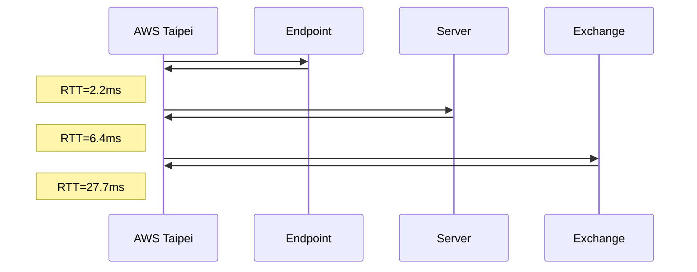

# Place Order Analysis

## Sequence Diagram

## Round Trip Time

Endpoint: `neoapi.fbs.com.tw:443`

```mermaid
sequenceDiagram
    participant AWS Taipei
    participant Endpoint
    participant Server
    participant Exchange

    AWS Taipei->>Endpoint:
    Endpoint->>AWS Taipei:
    Note left of AWS Taipei: RTT=2.2ms

    AWS Taipei->>Server:
    Server->>AWS Taipei:
    Note left of AWS Taipei: RTT=6.4ms

    AWS Taipei->>Exchange:
    Exchange->>AWS Taipei:
    Note left of AWS Taipei: RTT=27.7ms
```
