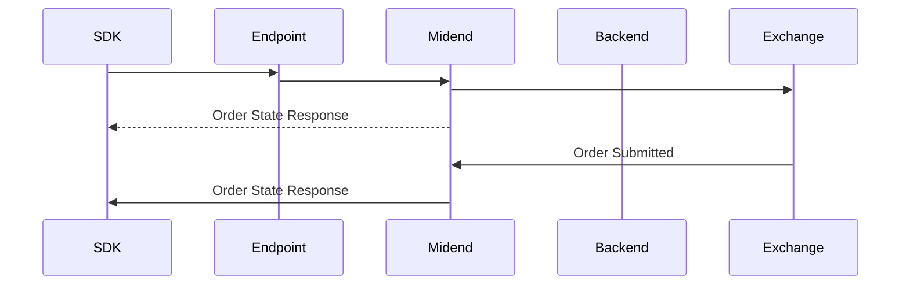
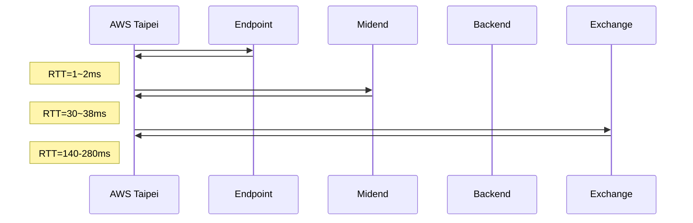

# Place Order Analysis

## Sequence Diagram



## Round Trip Time



## Profiling

### Environment

#### Hardware
- CPU: AMD Ryzen 5 5600XT

#### Software
- Python: 3.12
- Shioaji: `pip install shioaji==1.3.1`

> **Note**:
> Installing with `uv add shioaji --extra speed` may improve performance.

### Methodology

#### Measurement Scope
- **Start**: Before `api.place_order()` call
- **End**: After `api.place_order()` returns
- **Includes**: User space processing + network round-trip time

#### Tools
- `perf record` with DWARF call graph for CPU profiling (1000 Hz sampling)
- `strace` for syscall analysis
- `time.perf_counter_ns()` for wall-clock timing

### Results

#### Processing Time
- **Average**: 4-6 ms (user space processing, excluding network wait)
- **Network polling**: Shioaji SDK Solace client uses 50ms polling interval

#### CPU Usage by Shared Object

> **Terminology**:
> - **Self %**: CPU time spent executing code directly in this shared object
> - **Children %**: CPU time spent in functions called by this shared object

| Shared Object | Self % | Children % | Description |
|---------------|--------|------------|-------------|
| python3.12 | 68.24% | - | Python interpreter |
| [kernel.kallsyms] | 26.43% | - | Linux kernel (syscalls, memory) |
| libc.so.6 | 2.65% | - | C standard library |
| libcrypto.so.3 | 1.34% | - | OpenSSL cryptography |
| utils.cpython-312-x86_64-linux-gnu.so | ~0% | 33.49% | Shioaji SDK utilities (C extension) |
| api.cpython-312-x86_64-linux-gnu.so | ~0% | 6.01% | Shioaji SDK API (C extension) |
| _pydantic_core.cpython-312-x86_64-linux-gnu.so | 0.29% | - | Pydantic validation |
| libsolclient.so | ~0% | 0.17% | Solace messaging client |

**Observation**: The Shioaji C extensions (`utils.so`, `api.so`) show **Self ~0%** but significant **Children %**. This indicates a "dispatcher" pattern where the C code primarily calls back into Python rather than performing computation directly.

#### Call Graph Pattern

The Shioaji SDK uses a **mixed Python/C architecture**:

```
place_order.py (Python)
  └── api.place_order()
        └── api.cpython.so (C extension) [Self: ~0%]
              ├── PyObject_GetAttr() → Python interpreter
              ├── Pydantic validation → Python
              ├── utils.cpython.so (C extension) [Self: ~0%]
              │     └── PyObject_Call() → Python interpreter
              └── libsolclient.so → Network I/O
```

The overhead comes from frequent Python ↔ C transitions: `PyObject_GetAttr()` for attribute access, `PyObject_Call()` for function dispatch, and Pydantic validation in Python. This architecture trades performance for flexibility (Python callbacks, runtime validation).

#### CPU Usage by Function

| Function | Self % | Children % | Description |
|----------|--------|------------|-------------|
| _PyEval_EvalFrameDefault | 3.21% | 42.67% | Python bytecode interpreter main loop |
| PyObject_Vectorcall | ~0% | 13.15% | Python function call dispatch |
| PyObject_Malloc | 1.17% | - | Python object allocation |
| PyObject_GenericSetAttr | 0.87% | - | Python attribute setting |
| __GI___libc_malloc | 0.89% | - | glibc malloc |
| _int_malloc | 0.79% | - | glibc internal malloc |
| asm_exc_page_fault | 0.60% | - | Page fault handling |

#### Syscalls


| Syscall | Duration | Description |
|---------|----------|-------------|
| epoll_wait(..., 50) | 0-50 ms | Poll for network events with 50ms timeout |

The Solace messaging client polls for events with a **50ms timeout**. When no events are pending, `epoll_wait` blocks for the full 50ms before returning. When events arrive (server response), it returns immediately with the event data.
